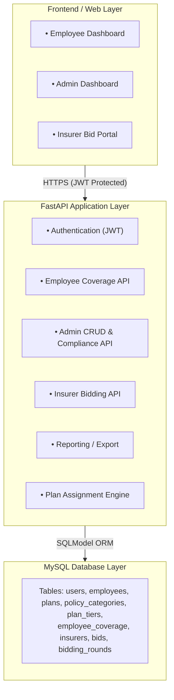

# TCX3901 Insurance Checking Portal

## 1. Project Description

The Insurance Checking Portal is a backend-driven web system designed to automate the insurance management workflow at Kurihara Kogyo Co. Ltd.

The system provides:
- Daily-use features such as employee insurance self-checking
- HR tools for plan assignment and FWMI compliance checking
- Annual bidding functions for insurers to submit quotations

This replaces Excel-based manual processes with a FastAPI–MySQL solution deployed on the NUS SoC VM using Docker.

---

## 2. Setup

### Step 1 — Clone the repository
git clone https://github.com/<your-repo>.git
cd insurance-checking-portal

### Step 2 — Start the system with Docker
docker-compose up -d

This starts:
- FastAPI backend (port 8000)
- MySQL database (port 3306)

### Step 3 — Access API documentation
http://<vm-hostname>:8000/docs

---

## 3. Code Structure

insurance-checking-portal/
│
├── api/                  
│   ├── main.py           
│   ├── auth/             
│   ├── models/           
│   ├── routers/          
│   ├── services/         
│   ├── database.py       
│   ├── seed.py           
│
├── sql/                  
│
├── web/                  
│
├── docker-compose.yml    
├── requirements.txt      
└── README.md             

---

## 4. User Stories

### 4.1 Employee User Stories
- As an employee, I want to view my insurance coverage so that I know my entitlements (GTL, GCI, GPA, GHS, GMM, FWMI).
- As an employee, I want to see claim document requirements so that I can prepare claims properly.
- As a WP/S-Pass holder, I want to check FWMI compliance so that I feel secure about my coverage.
- As an employee, I want to verify my ward class and limits before hospital visits so I can inform hospitals accurately.

### 4.2 HR Admin User Stories
- As an HR admin, I want to manage employee records so that insurance headcount remains accurate.
- As an HR admin, I want automatic plan assignment based on designation so that coverage allocation follows AIA plans.
- As an HR admin, I want to check FWMI non-compliance so that I avoid MOM penalties.
- As an HR admin, I want to compare insurer bids side-by-side so that I can choose the most cost-effective insurer.
- As an HR admin, I want to generate coverage reports so that I can submit them to management.

### 4.3 Insurer User Stories
- As an insurer, I want to view required categories so that I can prepare accurate quotations.
- As an insurer, I want to submit premiums for each policy type so that HR can evaluate my bids.
- As an insurer, I want to revise my bids before submission deadlines so that I can correct mistakes.

---

## 5. System Architecture

## 6. API Summary

Authentication:
POST /login

Employee:
GET /employees/{id}/coverage
GET /employees/{id}/claims

Admin:
POST /employees
PUT /employees/{id}
GET /coverage/compliance/fwmi
GET /bidding/summary

Insurer:
POST /bids
PUT /bids/{id}
GET /bidding_rounds/current

OpenAPI documentation:
http://<vm-hostname>:8000/docs

---

## 7. Database Schema

Key Tables:
- employees
- plans
- policy_categories
- plan_tiers
- employee_coverage
- insurers
- bids
- bidding_rounds

---

## 8. Diagrams
(Insert screenshots when ready)

System Architecture
ERD
Login Sequence Diagram
Plan Assignment Sequence Diagram
Bid Submission Sequence

---

## 9. Testing

9.1 JWT authentication tests  
9.2 Employee coverage retrieval tests  
9.3 Plan assignment logic tests  
9.4 FWMI compliance tests  
9.5 Bid submission validation tests  
9.6 MySQL integration tests  

---

## 10. Non-Functional Requirements (NFRs)

- API responses must return within 2 seconds.
- JWT must secure all protected endpoints.
- Coverage data must match AIA values exactly.
- System must run on SoC VM using Docker.
- Numeric values must use proper types (no float errors).

---

## 11. Deployment Instructions

Deploy on SoC VM:
git pull
docker-compose down
docker-compose up -d

Backend Access:
http://<vm-hostname>:8000

API Docs:
http://<vm-hostname>:8000/docs

---

## 12. References

- AIA Group Insurance Coverage Letter (29 Sept 2025)
- FastAPI Documentation
- SQLModel Documentation
- Docker Documentation
- BIT TCX3901 Module Guide
