# TCX3901 Insurance Checking Portal

## 1. Project Description

The Insurance Checking Portal is a backend-driven web system designed to automate the insurance management workflow at Kurihara Kogyo Co. Ltd.

The system provides:
- Daily-use features such as employee insurance self-checking
- HR tools for plan assignment and FWMI compliance checking
- Annual bidding functions for insurers to submit quotations

This replaces Excel-based manual processes with a FastAPI–MySQL solution deployed on the NUS SoC VM using Docker.

---

## 2. Setup

### Step 1 — Clone the repository
git clone https://github.com/<your-repo>.git
cd insurance-checking-portal

### Step 2 — Start the system with Docker
docker-compose up -d

This starts:
- FastAPI backend (port 8000)
- MySQL database (port 3306)

### Step 3 — Access API documentation
http://<vm-hostname>:8000/docs

---

## 3. Code Structure


```text
insurance-checking-portal/
├── api/
│   ├── main.py
│   ├── auth/
│   ├── models/
│   ├── routers/
│   └── services/
├── database.py
├── seed.py
├── sql/
├── web/
├── docker-compose.yml
├── requirements.txt
└── README.md
```

---

## 4. User Stories

### 4.1 Employee User Stories

---
### **🟦 User Story 1 — View Insurance Coverage**
**As an employee, I want to view my insurance coverage so that I know my entitlements (GTL, GCI, GPA, GHS, GMM, FWMI).**

#### **ORM Logic**
Return all insurance coverages assigned to the employee, grouped by category.

#### **ORM Entities**
- Employee  
- EmployeeCoverage  
- Plan  
- PolicyCategory  

```text
coverage = (
    session.query(EmployeeCoverage)
    .join(Plan)
    .join(PolicyCategory)
    .filter(EmployeeCoverage.employee_id == employee_id)
    .all()
)```


### **🟦 User Story 2 — Check Claim Document Requirements**
**As an employee, I want to see claim document requirements so that I can prepare claims properly.**

#### **ORM Logic**
Return all required documents based on the insurance category (GPA, GHS, etc.).

#### **ORM Entities**
- PolicyCategory
- DocumentRequirement

```text
requirements = (
    session.query(DocumentRequirement)
    .join(PolicyCategory)
    .filter(DocumentRequirement.category_id == category_id)
    .all()
)```


### **🟦 User Story 3 — Check FWMI Compliance**  
**As a WP/S-Pass holder, I want to check FWMI compliance so that I feel secure about my coverage.**

#### **ORM Logic**
Validate that the worker’s assigned FWMI meets MOM minimum medical coverage rules.
#### **ORM Entities**
- Employee
- EmployeeCoverage
- Plan
- PlanTier

```text
fwmi = (
    session.query(EmployeeCoverage)
    .join(Plan).join(PlanTier)
    .filter(
        EmployeeCoverage.employee_id == employee_id,
        PolicyCategory.code == "FWMI"
    )
    .first()
)

is_compliant = fwmi.plan_tier.coverage_amount >= MIN_FWMI_AMOUNT
```


### **🟦 User Story 4 — Verify Ward Class & Limits**
**As an employee, I want to verify my ward class and limits before hospital visits so I can inform hospitals accurately.**

#### **ORM Logic**
- Return the ward class (A/B1/B2) and maximum payout limit for medical procedures.
- ORM Entities
- EmployeeCoverage
- Plan
- PlanTier

```text
ward_info = (
    session.query(PlanTier)
    .join(Plan)
    .join(EmployeeCoverage)
    .filter(
        EmployeeCoverage.employee_id == employee_id,
        PolicyCategory.code == "GHS"   # GHS = Hospitalisation Plan
    )
    .first()
)

allowed_ward_class = ward_info.ward_class
max_limit = ward_info.annual_limit


### 4.2 HR Admin User Stories

---
### 🟥 **User Story 1 — Manage Employee Records**
**As an HR admin, I want to manage employee records so that insurance headcount remains accurate.**

#### **ORM Logic**
Allow HR to create, update, deactivate, and retrieve employee records.

#### **ORM Entities**
- Employee  
- EmploymentStatus  
- Department (optional)  

```text
employee = session.query(Employee).filter(Employee.id == emp_id).first()
# Update fields and commit```


### 🟥 **User Story 2 — Automatic Plan Assignment**
**As an HR admin, I want automatic plan assignment based on designation so that coverage allocation follows AIA plans.**

#### **ORM Logic**
Assign insurance plan tiers automatically based on employee designation.

#### **ORM Entities**
- Employee
- Plan
- PlanTier
- DesignationRule

```text
assigned_plan = (
    session.query(PlanTier)
    .filter(PlanTier.designation == employee.designation)
    .first()
)```


### 🟥 **User Story 3 — FWMI Non-Compliance Check**
**As an HR admin, I want to check FWMI non-compliance so that I avoid MOM penalties.**

#### **ORM Logic**
Identify workers whose FWMI coverage falls below MOM minimum coverage requirements.

#### **ORM Entities**
- Employee
- EmployeeCoverage
- PlanTier
- PolicyCategory

```text
non_compliant = (
    session.query(Employee)
    .join(EmployeeCoverage)
    .join(PlanTier)
    .filter(
        PolicyCategory.code == "FWMI",
        PlanTier.coverage_amount < MIN_FWMI_AMOUNT
    )
    .all()
)```


### 🟥 **User Story 4 — Compare Insurer Bids**
**As an HR admin, I want to compare insurer bids side-by-side so that I can choose the most cost-effective insurer.**

#### **ORM Logic**
Return all insurer bids for the same bidding round, ordered by premium.

#### **ORM Entities**
- Insurer
- Bid
- BiddingRound

```text
bids = (
    session.query(Bid)
    .join(Insurer)
    .filter(Bid.round_id == round_id)
    .order_by(Bid.price.asc())
    .all()
)```


### 🟥 **User Story 5 — Generate Coverage Reports**
**As an HR admin, I want to generate coverage reports so that I can submit them to management.**

#### **ORM Logic**
Summarise employee coverage count by insurance category.

#### **ORM Entities**
- Employee
- EmployeeCoverage
- Plan
- PolicyCategory

```text
report = (
    session.query(PolicyCategory, func.count(EmployeeCoverage.id))
    .join(EmployeeCoverage)
    .group_by(PolicyCategory.code)
    .all()
)```

### 4.3 Insurer User Stories

---
### 🟦 **User Story 1 — View Required Insurance Categories**
**As an insurer, I want to view required categories so that I can prepare accurate quotations.**

#### **ORM Logic**
Retrieve all insurance policy categories that require quotations for the active bidding round.

#### **ORM Entities**
- PolicyCategory  
- BiddingRound  
- CategoryRequirement (if defined)

```text
categories = (
    session.query(PolicyCategory)
    .filter(PolicyCategory.is_required == True)
    .all()
)```


### 🟦 **User Story 2 — Submit Premiums for Each Policy Type**
**As an insurer, I want to submit premiums for each policy type so that HR can evaluate my bids.**

#### **ORM Logic**
Allow insurers to insert or update premium submissions for each insurance category within a bidding round.

#### **ORM Entities**
- Insurer
- Bid
- PolicyCategory
- BiddingRound

```text
new_bid = Bid(
    insurer_id=insurer_id,
    category_id=category_id,
    round_id=round_id,
    premium=premium_amount
)
session.add(new_bid)
session.commit()```


### 🟦 **User Story 3 — Revise Bids Before Deadline**
**As an insurer, I want to revise my bids before submission deadlines so that I can correct mistakes.**

#### **ORM Logic**
Allow insurers to update existing bids if the current time is still before the bidding round deadline.

#### **ORM Entities**
- Bid
- BiddingRound
- Insurer

```text
bid = (
    session.query(Bid)
    .filter(
        Bid.insurer_id == insurer_id,
        Bid.round_id == round_id,
        Bid.category_id == category_id
    )
    .first()
)

if now < bidding_round.deadline:
    bid.premium = updated_amount
    session.commit()```

---

## 5. System Architecture

```mermaid
flowchart TD

Frontend["Frontend / Web Layer
• Employee Dashboard
• Admin Dashboard
• Insurer Bid Portal"]

FastAPI["FastAPI Application Layer
• Authentication (JWT)
• Employee Coverage API
• Admin CRUD & Compliance API
• Insurer Bidding API
• Reporting / Export
• Plan Assignment Engine"]

Database["MySQL Database Layer
Tables:
users, employees, plans,
policy_categories, plan_tiers,
employee_coverage, insurers,
bids, bidding_rounds"]

Frontend -->|"HTTPS (JWT Protected)"| FastAPI
FastAPI -->|"SQLModel ORM"| Database

%% LEFT ALIGN STYLE
classDef leftAlign text-align:left;
class Frontend,FastAPI,Database leftAlign;
```




---
## 6. API Summary

Authentication:
POST /login

Employee:
GET /employees/{id}/coverage
GET /employees/{id}/claims

Admin:
POST /employees
PUT /employees/{id}
GET /coverage/compliance/fwmi
GET /bidding/summary

Insurer:
POST /bids
PUT /bids/{id}
GET /bidding_rounds/current

OpenAPI documentation:
http://<vm-hostname>:8000/docs

---

## 7. Database Schema

Key Tables:
- employees
- plans
- policy_categories
- plan_tiers
- employee_coverage
- insurers
- bids
- bidding_rounds

---

## 8. Diagrams
(Insert screenshots when ready)

System Architecture
ERD
Login Sequence Diagram
Plan Assignment Sequence Diagram
Bid Submission Sequence

---

## 9. Testing

9.1 JWT authentication tests  
9.2 Employee coverage retrieval tests  
9.3 Plan assignment logic tests  
9.4 FWMI compliance tests  
9.5 Bid submission validation tests  
9.6 MySQL integration tests  

---

## 10. Non-Functional Requirements (NFRs)

- API responses must return within 2 seconds.
- JWT must secure all protected endpoints.
- Coverage data must match AIA values exactly.
- System must run on SoC VM using Docker.
- Numeric values must use proper types (no float errors).

---

## 11. Deployment Instructions

Deploy on SoC VM:
git pull
docker-compose down
docker-compose up -d

Backend Access:
http://<vm-hostname>:8000

API Docs:
http://<vm-hostname>:8000/docs

---

## 12. References

- AIA Group Insurance Coverage Letter (29 Sept 2025)
- FastAPI Documentation
- SQLModel Documentation
- Docker Documentation
- BIT TCX3901 Module Guide
